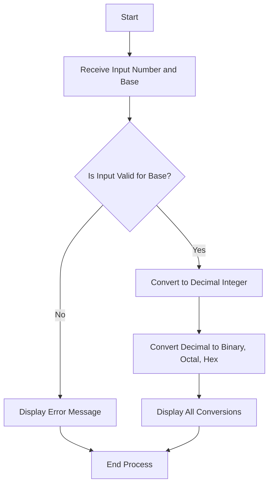

# Activity No. 1: Number System Converter
**Name:** Wilfred Justin D. Peteros  
**Course & Section:** CPE463H2  

### System Requirements
1. Hardware: A standard computer or laptop.
2. Software: A modern web browser like Google Chrome or Microsoft Edge.
3. Network: An active internet connection to load the Tailwind CSS framework via CDN.
4. Tools: A basic text editor such as Notepad for code modification.

### Algorithm
1. Start the program.
2. Prompt the user to enter a number in the input field.
3. Prompt the user to select the base of the entered number (Binary, Octal, Decimal, Hexadecimal).
4. Read the input value and the selected base.
5. Validate the input string against the allowed characters for the selected base using regular expressions.
6. If the input is invalid, display an error message and stop further processing.
7. If the input is valid, convert the string into a standard decimal integer.
8. Convert the decimal integer into Binary, Octal, Decimal, and Hexadecimal representations.
9. Display the four converted values on the user interface.
10. Repeat the process automatically for any changes in the input fields.
11. End the program.

### Flowchart


### Program Implementation
```html
<!DOCTYPE html>
<html lang="en">
<head>
  <meta charset="UTF-8">
  <meta name="viewport" content="width=device-width, initial-scale=1.0">
  <title>Number System Converter</title>
  <script src="https://cdn.tailwindcss.com"></script>
</head>
<body class="bg-slate-100 p-8 font-sans text-slate-800">
  <div class="max-w-4xl mx-auto bg-white p-8 rounded-xl shadow-lg">
    <h1 class="text-3xl font-extrabold mb-8 text-center text-indigo-600">Number System Converter</h1>
    <div class="grid grid-cols-1 gap-8">
      <div class="p-6 border border-slate-200 rounded-lg bg-slate-50">
        <label class="block font-bold mb-3 text-lg">Input 1</label>
        <div class="flex gap-4 mb-4">
          <input type="text" id="val1" class="border border-slate-300 p-3 rounded w-full text-lg focus:outline-none focus:ring-2 focus:ring-indigo-400" placeholder="Type a number..." oninput="convertNumber('val1', 'base1', 'out1')">
          <select id="base1" class="border border-slate-300 p-3 rounded bg-white text-lg focus:outline-none focus:ring-2 focus:ring-indigo-400" onchange="convertNumber('val1', 'base1', 'out1')">
            <option value="2">Binary (Base 2)</option>
            <option value="8">Octal (Base 8)</option>
            <option value="10" selected>Decimal (Base 10)</option>
            <option value="16">Hexadecimal (Base 16)</option>
          </select>
        </div>
        <div id="out1" class="mt-4 p-4 bg-white border border-slate-200 rounded text-slate-600 min-h-[100px]">
          Enter a valid number to see conversions.
        </div>
      </div>
    </div>
  </div>
  <script>
    function convertNumber(inputId, baseId, outputId) {
      const rawValue = document.getElementById(inputId).value.trim();
      const base = parseInt(document.getElementById(baseId).value);
      const outputDiv = document.getElementById(outputId);

      if (rawValue === "") {
        outputDiv.innerHTML = "Enter a valid number to see conversions.";
        return;
      }

      let isValid = false;
      if (base === 2) isValid = /^[01]+$/.test(rawValue);
      if (base === 8) isValid = /^[0-7]+$/.test(rawValue);
      if (base === 10) isValid = /^[0-9]+$/.test(rawValue);
      if (base === 16) isValid = /^[0-9a-fA-F]+$/.test(rawValue);

      if (!isValid) {
        outputDiv.innerHTML = "<span class='text-red-500 font-bold'>Invalid input for the selected number system.</span>";
        return;
      }

      const decimalValue = parseInt(rawValue, base);
      
      const binaryStr = decimalValue.toString(2);
      const octalStr = decimalValue.toString(8);
      const decimalStr = decimalValue.toString(10);
      const hexStr = decimalValue.toString(16).toUpperCase();

      outputDiv.innerHTML = `
        <div class="grid grid-cols-2 gap-2 text-lg">
          <div><span class="font-bold text-slate-800">Binary:</span> ${binaryStr}</div>
          <div><span class="font-bold text-slate-800">Octal:</span> ${octalStr}</div>
          <div><span class="font-bold text-slate-800">Decimal:</span> ${decimalStr}</div>
          <div><span class="font-bold text-slate-800">Hexadecimal:</span> ${hexStr}</div>
        </div>
      `;
    }
  </script>
</body>
</html>
```

### Test Cases
**Test Case 1: Binary Conversion**
1. Input Value: 1010
2. Selected Base: Binary (Base 2)
3. Expected Output: Binary: 1010, Octal: 12, Decimal: 10, Hexadecimal: A

**Test Case 2: Hexadecimal Conversion**
1. Input Value: 1F
2. Selected Base: Hexadecimal (Base 16)
3. Expected Output: Binary: 11111, Octal: 37, Decimal: 31, Hexadecimal: 1F

**Test Case 3: Invalid Input Handling**
1. Input Value: 9
2. Selected Base: Octal (Base 8)
3. Expected Output: "Invalid input for the selected number system." text appears in red.

### Sample Output
When the application opens, it displays a white container centered on the screen titled "Number System Converter". Three distinct input sections are visible. Typing the number "255" into the first field while "Decimal (Base 10)" is selected instantly populates the box below it with the text "Binary: 11111111", "Octal: 377", "Decimal: 255", and "Hexadecimal: FF". The layout is clear, organized, and updates in real time without needing to click a submit button.
