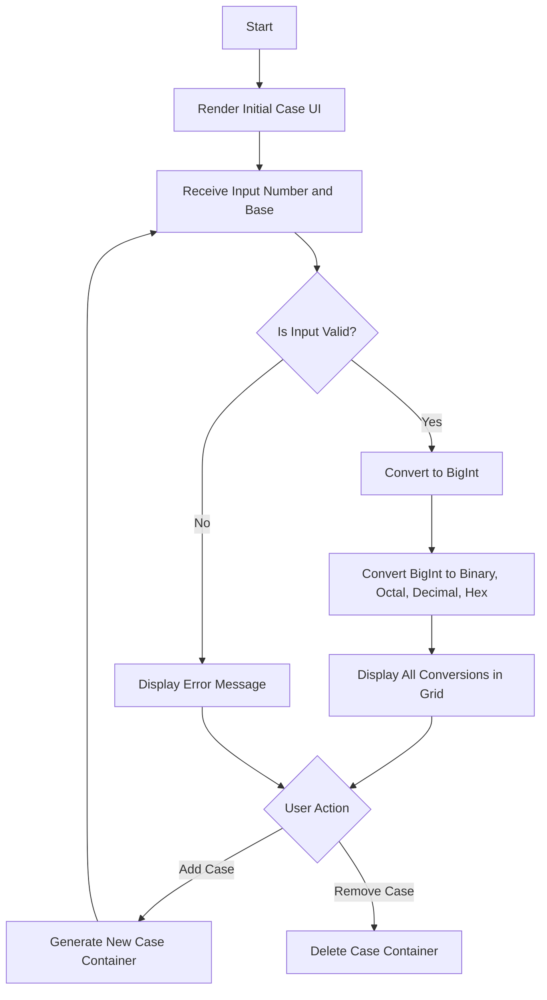

# Activity No. 1: Number System Converter
**Name:** Wilfred Justin D. Peteros  
**Course & Section:** CPE463H2  

### System Requirements
1. Hardware: A computer or laptop.
2. Software: A web browser like Google Chrome or Microsoft Edge.
3. Network: An internet connection to load the Tailwind CSS framework via CDN and Google Fonts.
4. Tools: A basic text editor such as Notepad for code modification.

### Algorithm
1. Start the program.
2. Initialize the dynamic case counter and display the first conversion case on the screen.
3. Prompt the user to enter a number in the input field.
4. Prompt the user to select the base of the entered number (Binary, Octal, Decimal, Hexadecimal).
5. Read the input value and the selected base.
6. Validate the input string against the allowed characters for the selected base using regular expressions.
7. If the input is invalid or exceeds safe limits, display an error message and stop further processing for that specific case.
8. If the input is valid, parse the string into a JavaScript BigInt to handle extremely large numbers without losing mathematical precision.
9. Convert the BigInt into Binary, Octal, Decimal, and Hexadecimal representations.
10. Display the four converted values within the grid of that specific case container.
11. Repeat the process automatically for any changes in the input fields or base dropdowns.
12. Allow the user to dynamically add new conversion cases or remove existing ones via interface buttons.
13. Allow the user to toggle the visual theme between light mode and dark mode.
14. End the program.

### Pseudocode
```text
START PROGRAM
  SET caseCounter = 0
  CALL addCase() TO render initial interface

  FUNCTION addCase()
    INCREMENT caseCounter BY 1
    INJECT HTML case container USING caseCounter AS ID
    CALL updateRemoveButtons()
  END FUNCTION

  FUNCTION removeCase(caseID)
    REMOVE HTML container MATCHING caseID
    CALL updateRemoveButtons()
  END FUNCTION

  FUNCTION convertNumber(caseID)
    READ rawValue FROM input field matching caseID
    READ inBase FROM dropdown matching caseID
    SET outputDiv = output container matching caseID

    IF rawValue IS EMPTY THEN
      DISPLAY "Awaiting input..." IN outputDiv
      RETURN
    END IF

    SET isValid = FALSE
    IF inBase == 2 THEN isValid = MATCH rawValue TO BINARY PATTERN
    IF inBase == 8 THEN isValid = MATCH rawValue TO OCTAL PATTERN
    IF inBase == 10 THEN isValid = MATCH rawValue TO DECIMAL PATTERN
    IF inBase == 16 THEN isValid = MATCH rawValue TO HEXADECIMAL PATTERN

    IF isValid IS FALSE THEN
      DISPLAY "Invalid input for the selected source base." IN outputDiv
      RETURN
    END IF

    TRY
      SET bigValue = CONVERT rawValue TO BigInt USING inBase
    CATCH ERROR
      DISPLAY "Number is too large or invalid." IN outputDiv
      RETURN
    END TRY

    SET binaryStr = CONVERT bigValue TO Base 2 STRING
    SET octalStr = CONVERT bigValue TO Base 8 STRING
    SET decimalStr = CONVERT bigValue TO Base 10 STRING
    SET hexStr = CONVERT bigValue TO Base 16 STRING (UPPERCASE)

    DISPLAY binaryStr, octalStr, decimalStr, hexStr IN outputDiv GRID
  END FUNCTION

  FUNCTION toggleTheme()
    TOGGLE "dark" CLASS ON document root
  END FUNCTION
END PROGRAM
```

### Flowchart


### Program Implementation
```html
<!DOCTYPE html>
<html lang="en" class="dark">
<head>
  <meta charset="UTF-8">
  <meta name="viewport" content="width=device-width, initial-scale=1.0">
  <title>Number System Converter</title>
  
  <link rel="preconnect" href="[https://fonts.googleapis.com](https://fonts.googleapis.com)">
  <link rel="preconnect" href="[https://fonts.gstatic.com](https://fonts.gstatic.com)" crossorigin>
  <link href="[https://fonts.googleapis.com/css2?family=Plus+Jakarta+Sans:wght@400;600;800&family=Space+Grotesk:wght@500;700&display=swap](https://fonts.googleapis.com/css2?family=Plus+Jakarta+Sans:wght@400;600;800&family=Space+Grotesk:wght@500;700&display=swap)" rel="stylesheet">
  
  <script src="[https://cdn.tailwindcss.com](https://cdn.tailwindcss.com)"></script>
  <script>
    tailwind.config = {
      darkMode: 'class',
      theme: {
        extend: {
          fontFamily: {
            sans: ['"Plus Jakarta Sans"', 'sans-serif'],
            mono: ['"Space Grotesk"', 'monospace'],
          }
        }
      }
    }
  </script>
</head>
<body class="bg-slate-50 dark:bg-slate-950 min-h-screen p-8 font-sans text-slate-800 dark:text-indigo-100 transition-colors duration-300">

  <div class="max-w-4xl mx-auto">
    <div class="flex justify-end mb-4">
      <button onclick="toggleTheme()" class="p-3 rounded-full shadow-lg bg-indigo-100 dark:bg-slate-800 text-indigo-700 dark:text-purple-400 hover:bg-indigo-200 dark:hover:bg-slate-700 border border-indigo-200 dark:border-indigo-800 transition-colors focus:outline-none focus:ring-2 focus:ring-indigo-500" title="Toggle Light/Dark Mode">
        <svg class="w-6 h-6 hidden dark:block" fill="none" stroke="currentColor" viewBox="0 0 24 24" xmlns="[http://www.w3.org/2000/svg](http://www.w3.org/2000/svg)">
          <path stroke-linecap="round" stroke-linejoin="round" stroke-width="2" d="M12 3v1m0 16v1m9-9h-1M4 12H3m15.364 6.364l-.707-.707M6.343 6.343l-.707-.707m12.728 0l-.707.707M6.343 17.657l-.707.707M16 12a4 4 0 11-8 0 4 4 0 018 0z"></path>
        </svg>
        <svg class="w-6 h-6 block dark:hidden" fill="none" stroke="currentColor" viewBox="0 0 24 24" xmlns="[http://www.w3.org/2000/svg](http://www.w3.org/2000/svg)">
          <path stroke-linecap="round" stroke-linejoin="round" stroke-width="2" d="M20.354 15.354A9 9 0 018.646 3.646 9.003 9.003 0 0012 21a9.003 9.003 0 008.354-5.646z"></path>
        </svg>
      </button>
    </div>

    <div class="bg-white dark:bg-slate-900 p-8 rounded-2xl shadow-xl border border-slate-200 dark:border-indigo-900 transition-colors duration-300">
      <h1 class="text-4xl font-extrabold mb-8 text-center text-indigo-700 dark:text-purple-400 font-mono tracking-tight">Number System Converter</h1>
      
      <div id="cases-container" class="grid grid-cols-1 gap-6">
      </div>

      <div class="mt-8 text-center">
        <button onclick="addCase()" class="bg-indigo-600 hover:bg-indigo-700 dark:bg-purple-700 dark:hover:bg-purple-600 text-white font-bold py-3 px-8 rounded-xl transition-colors shadow-lg focus:outline-none focus:ring-2 focus:ring-indigo-500">
          + Add Case
        </button>
      </div>
    </div>
  </div>

  <script>
    let caseCounter = 0;

    function toggleTheme() {
      document.documentElement.classList.toggle('dark');
    }

    function createCaseHTML(id) {
      return `
        <div id="case-${id}" class="p-6 border border-slate-200 dark:border-indigo-800 rounded-xl bg-slate-50 dark:bg-slate-800 relative shadow-sm dark:shadow-inner transition-colors duration-300">
          <div class="flex justify-between items-center mb-4">
            <label class="font-bold text-lg text-indigo-800 dark:text-purple-300">Conversion Case</label>
            <button onclick="removeCase(${id})" class="remove-btn p-2 text-red-500 dark:text-red-400 hover:text-red-700 dark:hover:text-red-300 hover:bg-red-100 dark:hover:bg-red-900/30 rounded-lg hidden transition-colors focus:outline-none" title="Remove Case">
              <svg class="w-5 h-5" fill="none" stroke="currentColor" viewBox="0 0 24 24" xmlns="[http://www.w3.org/2000/svg](http://www.w3.org/2000/svg)">
                <path stroke-linecap="round" stroke-linejoin="round" stroke-width="2" d="M6 18L18 6M6 6l12 12"></path>
              </svg>
            </button>
          </div>
          
          <div class="grid grid-cols-1 md:grid-cols-2 gap-4 mb-4">
            <div>
              <label class="block text-sm font-semibold text-slate-600 dark:text-indigo-300 mb-1">Input Value</label>
              <input type="text" id="val-${id}" class="w-full bg-white dark:bg-slate-900 border border-slate-300 dark:border-indigo-700 p-3 rounded-lg text-lg text-slate-900 dark:text-white focus:outline-none focus:ring-2 focus:ring-indigo-500 dark:focus:ring-purple-500 placeholder-slate-400 dark:placeholder-slate-500 transition-colors" placeholder="Type here..." oninput="convertNumber(${id})">
            </div>
            <div>
              <label class="block text-sm font-semibold text-slate-600 dark:text-indigo-300 mb-1">From Base</label>
              <select id="inBase-${id}" class="w-full bg-white dark:bg-slate-900 border border-slate-300 dark:border-indigo-700 p-3 rounded-lg text-lg text-slate-900 dark:text-white focus:outline-none focus:ring-2 focus:ring-indigo-500 dark:focus:ring-purple-500 transition-colors" onchange="convertNumber(${id})">
                <option value="2">Binary (Base 2)</option>
                <option value="8">Octal (Base 8)</option>
                <option value="10" selected>Decimal (Base 10)</option>
                <option value="16">Hexadecimal (Base 16)</option>
              </select>
            </div>
          </div>

          <div id="out-${id}" class="mt-4 p-4 bg-white dark:bg-slate-950 border border-slate-200 dark:border-indigo-900 rounded-lg min-h-[100px] flex items-center justify-center text-slate-500 dark:text-indigo-400 transition-colors duration-300">
            Awaiting input...
          </div>
        </div>
      `;
    }

    function addCase() {
      caseCounter++;
      const container = document.getElementById('cases-container');
      container.insertAdjacentHTML('beforeend', createCaseHTML(caseCounter));
      updateRemoveButtons();
    }

    function removeCase(id) {
      const caseEl = document.getElementById(`case-${id}`);
      if (caseEl && document.querySelectorAll('[id^="case-"]').length > 1) {
        caseEl.remove();
        updateRemoveButtons();
      }
    }

    function updateRemoveButtons() {
      const buttons = document.querySelectorAll('.remove-btn');
      if (buttons.length <= 1) {
        buttons.forEach(btn => btn.classList.add('hidden'));
      } else {
        buttons.forEach(btn => btn.classList.remove('hidden'));
      }
    }

    function convertNumber(id) {
      const rawValue = document.getElementById(`val-${id}`).value.trim();
      const inBase = parseInt(document.getElementById(`inBase-${id}`).value);
      const outputDiv = document.getElementById(`out-${id}`);

      if (rawValue === "") {
        outputDiv.innerHTML = "Awaiting input...";
        outputDiv.className = "mt-4 p-4 bg-white dark:bg-slate-950 border border-slate-200 dark:border-indigo-900 rounded-lg min-h-[100px] flex items-center justify-center text-slate-500 dark:text-indigo-400 text-lg transition-colors";
        return;
      }

      let isValid = false;
      if (inBase === 2) isValid = /^[01]+$/.test(rawValue);
      if (inBase === 8) isValid = /^[0-7]+$/.test(rawValue);
      if (inBase === 10) isValid = /^[0-9]+$/.test(rawValue);
      if (inBase === 16) isValid = /^[0-9a-fA-F]+$/.test(rawValue);

      if (!isValid) {
        outputDiv.innerHTML = "<span class='text-red-600 dark:text-red-400 font-bold'>Invalid input for the selected source base.</span>";
        outputDiv.className = "mt-4 p-4 bg-white dark:bg-slate-950 border border-slate-200 dark:border-indigo-900 rounded-lg min-h-[100px] flex items-center justify-center transition-colors";
        return;
      }

      let bigValue;
      try {
        if (inBase === 2) bigValue = BigInt("0b" + rawValue);
        else if (inBase === 8) bigValue = BigInt("0o" + rawValue);
        else if (inBase === 10) bigValue = BigInt(rawValue);
        else if (inBase === 16) bigValue = BigInt("0x" + rawValue);
      } catch (e) {
        outputDiv.innerHTML = "<span class='text-red-600 dark:text-red-400 font-bold'>Number is too large or invalid.</span>";
        outputDiv.className = "mt-4 p-4 bg-white dark:bg-slate-950 border border-slate-200 dark:border-indigo-900 rounded-lg min-h-[100px] flex items-center justify-center transition-colors";
        return;
      }
      
      const binaryStr = bigValue.toString(2);
      const octalStr = bigValue.toString(8);
      const decimalStr = bigValue.toString(10);
      const hexStr = bigValue.toString(16).toUpperCase();

      outputDiv.innerHTML = `
        <div class="grid grid-cols-2 gap-4 w-full">
          <div class="bg-slate-50 dark:bg-slate-900 p-4 rounded-lg border border-slate-200 dark:border-indigo-800 min-w-0 flex flex-col max-h-48">
            <span class="block text-sm font-semibold text-slate-500 dark:text-indigo-400 mb-2 shrink-0">Binary</span>
            <div class="overflow-y-auto pr-2"><span class="text-xl md:text-2xl font-mono font-bold text-indigo-700 dark:text-purple-300 break-all">${binaryStr}</span></div>
          </div>
          <div class="bg-slate-50 dark:bg-slate-900 p-4 rounded-lg border border-slate-200 dark:border-indigo-800 min-w-0 flex flex-col max-h-48">
            <span class="block text-sm font-semibold text-slate-500 dark:text-indigo-400 mb-2 shrink-0">Octal</span>
            <div class="overflow-y-auto pr-2"><span class="text-xl md:text-2xl font-mono font-bold text-indigo-700 dark:text-purple-300 break-all">${octalStr}</span></div>
          </div>
          <div class="bg-slate-50 dark:bg-slate-900 p-4 rounded-lg border border-slate-200 dark:border-indigo-800 min-w-0 flex flex-col max-h-48">
            <span class="block text-sm font-semibold text-slate-500 dark:text-indigo-400 mb-2 shrink-0">Decimal</span>
            <div class="overflow-y-auto pr-2"><span class="text-xl md:text-2xl font-mono font-bold text-indigo-700 dark:text-purple-300 break-all">${decimalStr}</span></div>
          </div>
          <div class="bg-slate-50 dark:bg-slate-900 p-4 rounded-lg border border-slate-200 dark:border-indigo-800 min-w-0 flex flex-col max-h-48">
            <span class="block text-sm font-semibold text-slate-500 dark:text-indigo-400 mb-2 shrink-0">Hexadecimal</span>
            <div class="overflow-y-auto pr-2"><span class="text-xl md:text-2xl font-mono font-bold text-indigo-700 dark:text-purple-300 break-all">${hexStr}</span></div>
          </div>
        </div>
      `;
      outputDiv.className = "mt-4 p-4 bg-white dark:bg-slate-950 border border-slate-200 dark:border-indigo-900 rounded-lg min-h-[100px] transition-colors";
    }

    addCase();
  </script>

</body>
</html>
```

### Test Cases
**Test Case 1: Binary Conversion**
1. Input Value: 1010
2. Selected Base: Binary (Base 2)
3. Expected Output: Binary: 1010, Octal: 12, Decimal: 10, Hexadecimal: A

**Test Case 2: Hexadecimal Conversion**
1. Input Value: 1F
2. Selected Base: Hexadecimal (Base 16)
3. Expected Output: Binary: 11111, Octal: 37, Decimal: 31, Hexadecimal: 1F

**Test Case 3: Invalid Input Handling**
1. Input Value: 9
2. Selected Base: Octal (Base 8)
3. Expected Output: "Invalid input for the selected number system." text appears in red.

**Test Case 4: Mathematical Bounds Limits**
1. Input Value: 99999999999999999999
2. Selected Base: Decimal (Base 10)
3. Expected Output: Hexadecimal correctly outputs 56BC75E2D63100000 instead of converting the string into scientific notation. Text elegantly wraps within the container bounds.

### Sample Output
When the application opens, it displays a white container centered on the screen titled "Number System Converter". Three distinct input sections are visible. Typing the number "255" into the first field while "Decimal (Base 10)" is selected instantly populates the box below it with the text "Binary: 11111111", "Octal: 377", "Decimal: 255", and "Hexadecimal: FF". The layout is clear, organized, and updates in real time without needing to click a submit button.
