# Activity No. 1: Number System Converter and Arithmetic Calculator
**Name:** Wilfred Justin D. Peteros  
**Course & Section:** CPE463-H2  
**Instructor:** Engr. Johnalyn L. Figueras

### System Requirements
1. Hardware: A computer or laptop.
2. Software: A modern web browser like Google Chrome or Microsoft Edge.
3. Network: An active internet connection to load the Tailwind CSS framework via CDN and Google Fonts.
4. Tools: A basic text editor such as Notepad for code modification.

### Algorithm
1. Start the program.
2. Initialize the user interface with three default input cases and a global arithmetic operation selector.
3. Allow the user to select an arithmetic operation (Addition, Subtraction, Multiplication, Division).
4. Prompt the user to enter a number and select its corresponding base (Binary, Octal, Decimal, Hexadecimal) for each input field.
5. Validate each input string against the allowed characters for its selected base.
6. Display individual conversion results (Binary, Octal, Decimal, Hexadecimal) for each valid input block.
7. Convert all valid input strings into a common representation (`BigInt`) to maintain mathematical precision across mixed bases.
8. Perform the selected arithmetic operation sequentially on the converted `BigInt` values.
9. Construct and display the mathematical expression using the original input values and their base subscripts.
10. Display the final computed result in Binary, Octal, Decimal, and Hexadecimal formats.
11. Handle invalid inputs, empty fields, and mathematical errors (like division by zero) by displaying appropriate error messages.
12. Allow the user to dynamically add or remove input cases via interface buttons.
13. End the program.

### Pseudocode
```text
START PROGRAM
  SET caseCounter = 0
  CALL addCase() THREE TIMES to render initial interface

  FUNCTION calculateTotal()
    READ globalOperation FROM selector (add, sub, mul, div)
    SET valuesArray = []
    SET expressionsArray = []
    
    FOR EACH active case container:
      READ rawValue AND inBase
      IF rawValue IS INVALID THEN ABORT AND DISPLAY ERROR
      
      SET bigValue = CONVERT rawValue TO BigInt USING inBase
      APPEND bigValue TO valuesArray
      APPEND formatted original string with base subscript TO expressionsArray
    END FOR
    
    IF valuesArray LENGTH < 2 THEN RETURN

    SET finalResult = valuesArray[0]
    FOR i = 1 TO valuesArray LENGTH - 1:
      IF globalOperation == 'add' THEN finalResult = finalResult + valuesArray[i]
      IF globalOperation == 'sub' THEN finalResult = finalResult - valuesArray[i]
      IF globalOperation == 'mul' THEN finalResult = finalResult * valuesArray[i]
      IF globalOperation == 'div' THEN 
        IF valuesArray[i] == 0 THEN DISPLAY ERROR "Division by zero" AND ABORT
        finalResult = finalResult / valuesArray[i]
    END FOR
    
    DISPLAY expressionsArray AS Equation
    DISPLAY CONVERT finalResult TO Base 2, 8, 10, 16 IN Final Output Grid
  END FUNCTION
END PROGRAM
```

### Flowchart
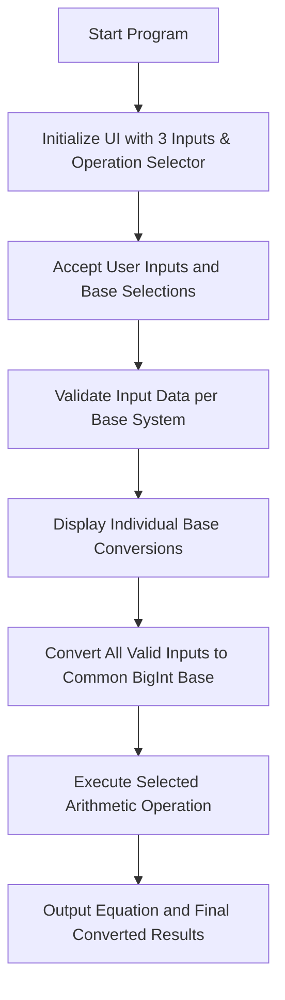

### Program Implementation
```html
<!DOCTYPE html>
<html lang="en" class="dark">
<head>
  <meta charset="UTF-8">
  <meta name="viewport" content="width=device-width, initial-scale=1.0">
  <title>Number System Converter & Calculator</title>
  
  <link rel="preconnect" href="[https://fonts.googleapis.com](https://fonts.googleapis.com)">
  <link rel="preconnect" href="[https://fonts.gstatic.com](https://fonts.gstatic.com)" crossorigin>
  <link href="[https://fonts.googleapis.com/css2?family=Plus+Jakarta+Sans:wght@400;600;800&family=Space+Grotesk:wght@500;700&display=swap](https://fonts.googleapis.com/css2?family=Plus+Jakarta+Sans:wght@400;600;800&family=Space+Grotesk:wght@500;700&display=swap)" rel="stylesheet">
  
  <script src="[https://cdn.tailwindcss.com](https://cdn.tailwindcss.com)"></script>
  <script>
    tailwind.config = {
      darkMode: 'class',
      theme: {
        extend: {
          fontFamily: {
            sans: ['"Plus Jakarta Sans"', 'sans-serif'],
            mono: ['"Space Grotesk"', 'monospace'],
          }
        }
      }
    }
  </script>
</head>
<body class="bg-slate-50 dark:bg-slate-950 min-h-screen p-4 md:p-8 font-sans text-slate-800 dark:text-indigo-100 transition-colors duration-300">

  <div class="max-w-5xl mx-auto">
    <div class="flex justify-end mb-4">
      <button onclick="toggleTheme()" class="p-3 rounded-full shadow-lg bg-indigo-100 dark:bg-slate-800 text-indigo-700 dark:text-purple-400 hover:bg-indigo-200 dark:hover:bg-slate-700 border border-indigo-200 dark:border-indigo-800 transition-colors focus:outline-none focus:ring-2 focus:ring-indigo-500" title="Toggle Light/Dark Mode">
        <svg class="w-6 h-6 hidden dark:block" fill="none" stroke="currentColor" viewBox="0 0 24 24" xmlns="[http://www.w3.org/2000/svg](http://www.w3.org/2000/svg)">
          <path stroke-linecap="round" stroke-linejoin="round" stroke-width="2" d="M12 3v1m0 16v1m9-9h-1M4 12H3m15.364 6.364l-.707-.707M6.343 6.343l-.707-.707m12.728 0l-.707.707M6.343 17.657l-.707.707M16 12a4 4 0 11-8 0 4 4 0 018 0z"></path>
        </svg>
        <svg class="w-6 h-6 block dark:hidden" fill="none" stroke="currentColor" viewBox="0 0 24 24" xmlns="[http://www.w3.org/2000/svg](http://www.w3.org/2000/svg)">
          <path stroke-linecap="round" stroke-linejoin="round" stroke-width="2" d="M20.354 15.354A9 9 0 018.646 3.646 9.003 9.003 0 0012 21a9.003 9.003 0 008.354-5.646z"></path>
        </svg>
      </button>
    </div>

    <div class="bg-white dark:bg-slate-900 p-6 md:p-8 rounded-2xl shadow-xl border border-slate-200 dark:border-indigo-900 transition-colors duration-300">
      <h1 class="text-3xl md:text-4xl font-extrabold mb-8 text-center text-indigo-700 dark:text-purple-400 font-mono tracking-tight">System Converter & Calculator</h1>
      
      <div class="mb-8 p-6 bg-indigo-50 dark:bg-indigo-950/30 border border-indigo-200 dark:border-indigo-800 rounded-xl">
        <label class="block text-lg font-bold text-indigo-800 dark:text-purple-300 mb-3 text-center">Select Arithmetic Operation</label>
        <select id="global-operation" class="w-full md:w-1/2 mx-auto block bg-white dark:bg-slate-900 border border-indigo-300 dark:border-indigo-700 p-4 rounded-lg text-xl text-slate-900 dark:text-white font-bold text-center focus:outline-none focus:ring-4 focus:ring-indigo-500 dark:focus:ring-purple-500 transition-colors shadow-sm" onchange="calculateTotal()">
          <option value="add">Addition (+)</option>
          <option value="sub">Subtraction (-)</option>
          <option value="mul">Multiplication (×)</option>
          <option value="div">Division (÷)</option>
        </select>
      </div>

      <div id="cases-container" class="grid grid-cols-1 gap-6">
      </div>

      <div class="mt-6 text-center">
        <button onclick="addCase()" class="bg-indigo-600 hover:bg-indigo-700 dark:bg-slate-800 dark:hover:bg-slate-700 border border-transparent dark:border-indigo-700 text-white dark:text-purple-300 font-bold py-3 px-8 rounded-xl transition-colors shadow-lg focus:outline-none focus:ring-2 focus:ring-indigo-500">
          + Add Input Number
        </button>
      </div>

      <div class="mt-12 p-8 bg-slate-900 dark:bg-black border-2 border-indigo-500 dark:border-purple-600 rounded-2xl shadow-2xl relative overflow-hidden">
        <div class="absolute top-0 left-0 w-full h-1 bg-gradient-to-r from-indigo-500 via-purple-500 to-pink-500"></div>
        <h2 class="text-2xl font-bold text-white mb-6 text-center">Final Arithmetic Result</h2>
        <div id="final-total-container" class="text-center">
          <p class="text-slate-400 text-lg">Enter valid numbers in all fields above to compute the final result.</p>
        </div>
      </div>

    </div>
  </div>

  <script>
    let caseCounter = 0;

    function toggleTheme() {
      document.documentElement.classList.toggle('dark');
    }

    function createCaseHTML(id) {
      return `
        <div id="case-${id}" class="p-6 border border-slate-200 dark:border-indigo-800 rounded-xl bg-slate-50 dark:bg-slate-800 relative shadow-sm dark:shadow-inner transition-colors duration-300">
          <div class="flex justify-between items-center mb-4">
            <label class="font-bold text-lg text-indigo-800 dark:text-purple-300">Input ${id}</label>
            <button onclick="removeCase(${id})" class="remove-btn p-2 text-red-500 dark:text-red-400 hover:text-red-700 dark:hover:text-red-300 hover:bg-red-100 dark:hover:bg-red-900/30 rounded-lg hidden transition-colors focus:outline-none" title="Remove Input">
              <svg class="w-5 h-5" fill="none" stroke="currentColor" viewBox="0 0 24 24" xmlns="[http://www.w3.org/2000/svg](http://www.w3.org/2000/svg)">
                <path stroke-linecap="round" stroke-linejoin="round" stroke-width="2" d="M6 18L18 6M6 6l12 12"></path>
              </svg>
            </button>
          </div>
          
          <div class="grid grid-cols-1 md:grid-cols-2 gap-4 mb-4">
            <div>
              <label class="block text-sm font-semibold text-slate-600 dark:text-indigo-300 mb-1">Value</label>
              <input type="text" id="val-${id}" class="w-full bg-white dark:bg-slate-900 border border-slate-300 dark:border-indigo-700 p-3 rounded-lg text-lg font-mono text-slate-900 dark:text-white focus:outline-none focus:ring-2 focus:ring-indigo-500 dark:focus:ring-purple-500 placeholder-slate-400 dark:placeholder-slate-500 transition-colors" placeholder="0" oninput="handleInput(${id})">
            </div>
            <div>
              <label class="block text-sm font-semibold text-slate-600 dark:text-indigo-300 mb-1">Base System</label>
              <select id="inBase-${id}" class="w-full bg-white dark:bg-slate-900 border border-slate-300 dark:border-indigo-700 p-3 rounded-lg text-lg text-slate-900 dark:text-white focus:outline-none focus:ring-2 focus:ring-indigo-500 dark:focus:ring-purple-500 transition-colors" onchange="handleInput(${id})">
                <option value="2">Binary (Base 2)</option>
                <option value="8">Octal (Base 8)</option>
                <option value="10" selected>Decimal (Base 10)</option>
                <option value="16">Hexadecimal (Base 16)</option>
              </select>
            </div>
          </div>

          <div id="out-${id}" class="mt-4 p-4 bg-white dark:bg-slate-950 border border-slate-200 dark:border-indigo-900 rounded-lg min-h-[80px] flex items-center justify-center text-slate-500 dark:text-indigo-400 transition-colors duration-300">
            Awaiting input...
          </div>
        </div>
      `;
    }

    function addCase() {
      caseCounter++;
      const container = document.getElementById('cases-container');
      container.insertAdjacentHTML('beforeend', createCaseHTML(caseCounter));
      updateRemoveButtons();
      calculateTotal();
    }

    function removeCase(id) {
      const caseEl = document.getElementById(`case-${id}`);
      if (caseEl && document.querySelectorAll('[id^="case-"]').length > 2) {
        caseEl.remove();
        updateRemoveButtons();
        calculateTotal();
      }
    }

    function updateRemoveButtons() {
      const buttons = document.querySelectorAll('.remove-btn');
      if (buttons.length <= 2) {
        buttons.forEach(btn => btn.classList.add('hidden'));
      } else {
        buttons.forEach(btn => btn.classList.remove('hidden'));
      }
    }

    function handleInput(id) {
      convertIndividualNumber(id);
      calculateTotal();
    }

    function convertIndividualNumber(id) {
      const rawValue = document.getElementById(`val-${id}`).value.trim();
      const inBase = parseInt(document.getElementById(`inBase-${id}`).value);
      const outputDiv = document.getElementById(`out-${id}`);

      if (rawValue === "") {
        outputDiv.innerHTML = "Awaiting input...";
        outputDiv.className = "mt-4 p-4 bg-white dark:bg-slate-950 border border-slate-200 dark:border-indigo-900 rounded-lg min-h-[80px] flex items-center justify-center text-slate-500 dark:text-indigo-400 text-lg transition-colors";
        return;
      }

      let isValid = false;
      if (inBase === 2) isValid = /^-?[01]+$/.test(rawValue);
      if (inBase === 8) isValid = /^-?[0-7]+$/.test(rawValue);
      if (inBase === 10) isValid = /^-?[0-9]+$/.test(rawValue);
      if (inBase === 16) isValid = /^-?[0-9a-fA-F]+$/.test(rawValue);

      if (!isValid) {
        outputDiv.innerHTML = "<span class='text-red-600 dark:text-red-400 font-bold'>Invalid input for selected base.</span>";
        outputDiv.className = "mt-4 p-4 bg-white dark:bg-slate-950 border border-slate-200 dark:border-indigo-900 rounded-lg min-h-[80px] flex items-center justify-center transition-colors";
        return;
      }

      let bigValue;
      try {
        let cleanVal = rawValue.replace('-', '');
        let prefix = inBase === 2 ? '0b' : inBase === 8 ? '0o' : inBase === 16 ? '0x' : '';
        bigValue = BigInt((rawValue.startsWith('-') ? '-' : '') + prefix + cleanVal);
      } catch (e) {
        outputDiv.innerHTML = "<span class='text-red-600 dark:text-red-400 font-bold'>Number error.</span>";
        return;
      }
      
      const isNeg = bigValue < 0n;
      const absVal = isNeg ? -bigValue : bigValue;
      const sign = isNeg ? '-' : '';

      const binStr = sign + absVal.toString(2);
      const octStr = sign + absVal.toString(8);
      const decStr = bigValue.toString(10);
      const hexStr = sign + absVal.toString(16).toUpperCase();

      outputDiv.innerHTML = `
        <div class="grid grid-cols-2 lg:grid-cols-4 gap-3 w-full">
          <div class="bg-slate-50 dark:bg-slate-900 p-3 rounded-lg border border-slate-200 dark:border-indigo-800 min-w-0 flex flex-col">
            <span class="text-xs font-semibold text-slate-500 dark:text-indigo-400 mb-1">Binary</span>
            <div class="overflow-x-auto"><span class="text-sm font-mono font-bold text-indigo-700 dark:text-purple-300 break-all">${binStr}</span></div>
          </div>
          <div class="bg-slate-50 dark:bg-slate-900 p-3 rounded-lg border border-slate-200 dark:border-indigo-800 min-w-0 flex flex-col">
            <span class="text-xs font-semibold text-slate-500 dark:text-indigo-400 mb-1">Octal</span>
            <div class="overflow-x-auto"><span class="text-sm font-mono font-bold text-indigo-700 dark:text-purple-300 break-all">${octStr}</span></div>
          </div>
          <div class="bg-slate-50 dark:bg-slate-900 p-3 rounded-lg border border-slate-200 dark:border-indigo-800 min-w-0 flex flex-col">
            <span class="text-xs font-semibold text-slate-500 dark:text-indigo-400 mb-1">Decimal</span>
            <div class="overflow-x-auto"><span class="text-sm font-mono font-bold text-indigo-700 dark:text-purple-300 break-all">${decStr}</span></div>
          </div>
          <div class="bg-slate-50 dark:bg-slate-900 p-3 rounded-lg border border-slate-200 dark:border-indigo-800 min-w-0 flex flex-col">
            <span class="text-xs font-semibold text-slate-500 dark:text-indigo-400 mb-1">Hexadecimal</span>
            <div class="overflow-x-auto"><span class="text-sm font-mono font-bold text-indigo-700 dark:text-purple-300 break-all">${hexStr}</span></div>
          </div>
        </div>
      `;
      outputDiv.className = "mt-4 p-3 bg-white dark:bg-slate-950 border border-slate-200 dark:border-indigo-900 rounded-lg min-h-[80px] transition-colors";
    }

    function calculateTotal() {
      const cases = document.querySelectorAll('[id^="case-"]');
      const totalDiv = document.getElementById('final-total-container');
      
      let values = [];
      let expressions = [];
      let allValid = true;

      cases.forEach(caseEl => {
        const id = caseEl.id.split('-')[1];
        const rawValue = document.getElementById(`val-${id}`).value.trim();
        const inBase = parseInt(document.getElementById(`inBase-${id}`).value);

        if (!rawValue) {
          allValid = false;
          return;
        }

        let isValid = false;
        if (inBase === 2) isValid = /^-?[01]+$/.test(rawValue);
        if (inBase === 8) isValid = /^-?[0-7]+$/.test(rawValue);
        if (inBase === 10) isValid = /^-?[0-9]+$/.test(rawValue);
        if (inBase === 16) isValid = /^-?[0-9a-fA-F]+$/.test(rawValue);

        if (!isValid) {
          allValid = false;
          return;
        }

        try {
          let cleanVal = rawValue.replace('-', '');
          let prefix = inBase === 2 ? '0b' : inBase === 8 ? '0o' : inBase === 16 ? '0x' : '';
          let bigVal = BigInt((rawValue.startsWith('-') ? '-' : '') + prefix + cleanVal);
          values.push(bigVal);

          const sub = inBase === 2 ? '₂' : inBase === 8 ? '₈' : inBase === 10 ? '₁₀' : '₁₆';
          expressions.push(`(${rawValue})${sub}`);
        } catch (e) {
          allValid = false;
        }
      });

      if (values.length < 2 || !allValid) {
        totalDiv.innerHTML = "<p class='text-slate-400 text-lg'>Enter valid numbers in all active fields to compute the final result.</p>";
        return;
      }

      const operation = document.getElementById('global-operation').value;
      let opSymbol = operation === 'add' ? '+' : operation === 'sub' ? '-' : operation === 'mul' ? '×' : '÷';

      let finalResult = values[0];
      try {
        for (let i = 1; i < values.length; i++) {
          if (operation === 'add') finalResult += values[i];
          else if (operation === 'sub') finalResult -= values[i];
          else if (operation === 'mul') finalResult *= values[i];
          else if (operation === 'div') {
            if (values[i] === 0n) throw new Error("Division by zero");
            finalResult /= values[i]; 
          }
        }
      } catch (err) {
        totalDiv.innerHTML = `<p class='text-red-400 text-xl font-bold'>Error: ${err.message}</p>`;
        return;
      }

      const isNeg = finalResult < 0n;
      const absRes = isNeg ? -finalResult : finalResult;
      const sign = isNeg ? '-' : '';

      const binStr = sign + absRes.toString(2);
      const octStr = sign + absRes.toString(8);
      const decStr = finalResult.toString(10);
      const hexStr = sign + absRes.toString(16).toUpperCase();

      totalDiv.innerHTML = `
        <div class="mb-6 p-4 bg-slate-800 rounded-lg border border-slate-700 shadow-inner overflow-x-auto">
          <p class="text-indigo-300 text-sm font-bold uppercase tracking-wider mb-2">Equation</p>
          <p class="text-xl md:text-2xl font-mono text-white whitespace-nowrap">${expressions.join(` <span class="text-pink-400 mx-2">${opSymbol}</span> `)} <span class="text-pink-400 mx-2">=</span></p>
        </div>
        
        <div class="grid grid-cols-1 md:grid-cols-2 gap-4">
          <div class="bg-slate-800 p-4 rounded-xl border border-slate-700 text-left overflow-hidden">
            <span class="block text-sm font-bold text-slate-400 mb-1">Binary</span>
            <div class="overflow-x-auto"><span class="text-xl md:text-2xl font-mono font-bold text-green-400 break-all">${binStr}</span></div>
          </div>
          <div class="bg-slate-800 p-4 rounded-xl border border-slate-700 text-left overflow-hidden">
            <span class="block text-sm font-bold text-slate-400 mb-1">Octal</span>
            <div class="overflow-x-auto"><span class="text-xl md:text-2xl font-mono font-bold text-blue-400 break-all">${octStr}</span></div>
          </div>
          <div class="bg-slate-800 p-4 rounded-xl border border-slate-700 text-left overflow-hidden">
            <span class="block text-sm font-bold text-slate-400 mb-1">Decimal</span>
            <div class="overflow-x-auto"><span class="text-xl md:text-2xl font-mono font-bold text-yellow-400 break-all">${decStr}</span></div>
          </div>
          <div class="bg-slate-800 p-4 rounded-xl border border-slate-700 text-left overflow-hidden">
            <span class="block text-sm font-bold text-slate-400 mb-1">Hexadecimal</span>
            <div class="overflow-x-auto"><span class="text-xl md:text-2xl font-mono font-bold text-pink-400 break-all">${hexStr}</span></div>
          </div>
        </div>
      `;
    }

    addCase();
    addCase();
    addCase();
  </script>

</body>
</html>
```

#### Test Cases
**Test Case 1: Binary Conversion**
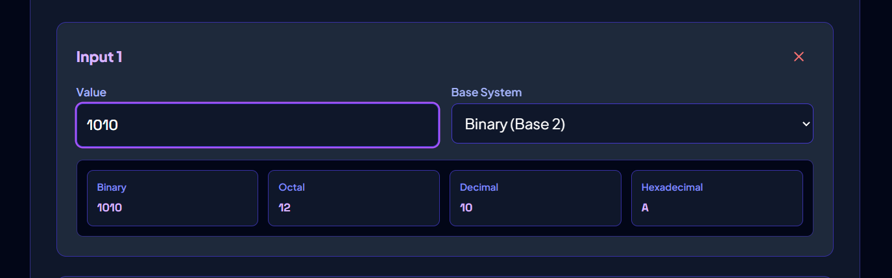
1. Input Value: 1010
2. Selected Base: Binary (Base 2)
3. Expected Output: Binary: 1010, Octal: 12, Decimal: 10, Hexadecimal: A

**Test Case 2: Hexadecimal Conversion**
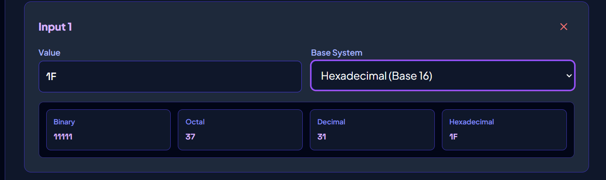
1. Input Value: 1F
2. Selected Base: Hexadecimal (Base 16)
3. Expected Output: Binary: 11111, Octal: 37, Decimal: 31, Hexadecimal: 1F

**Test Case 3: Invalid Input Handling**
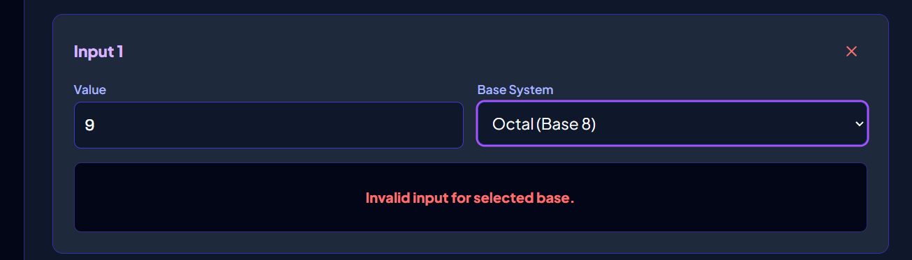
1. Input Value: 9
2. Selected Base: Octal (Base 8)
3. Expected Output: "Invalid input for the selected number system." text appears in red.

**Test Case 4: Mathematical Bounds Limits**
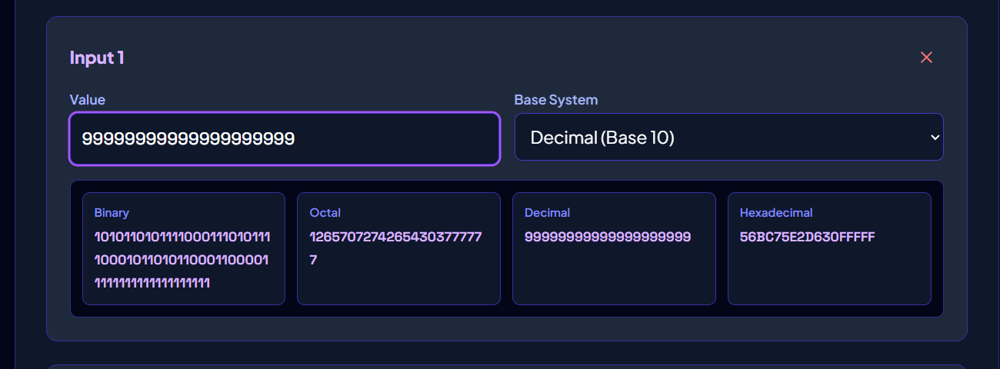
1. Input Value: 99999999999999999999
2. Selected Base: Decimal (Base 10)
3. Expected Output: Hexadecimal correctly outputs 56BC75E2D63100000 instead of converting the string into scientific notation.

**Test Case 5: Binary + Octal + Decimal (Addition)**
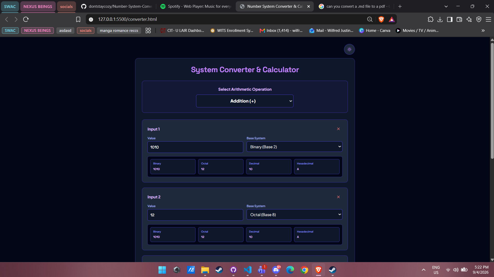

1. Inputs: `1010` (Base 2), `12` (Base 8), `10` (Base 10)
2. Global Operation: Addition (+)
3. Expected Output: Equation correctly identifies `(1010)₂ + (12)₈ + (10)₁₀`. 
4. Final arithmetic Result: Binary: `11110`, Octal: `36`, Decimal: `30`, Hexadecimal: `1E`.

**Test Case 6: Binary + Decimal + Hexadecimal (Subtraction)**
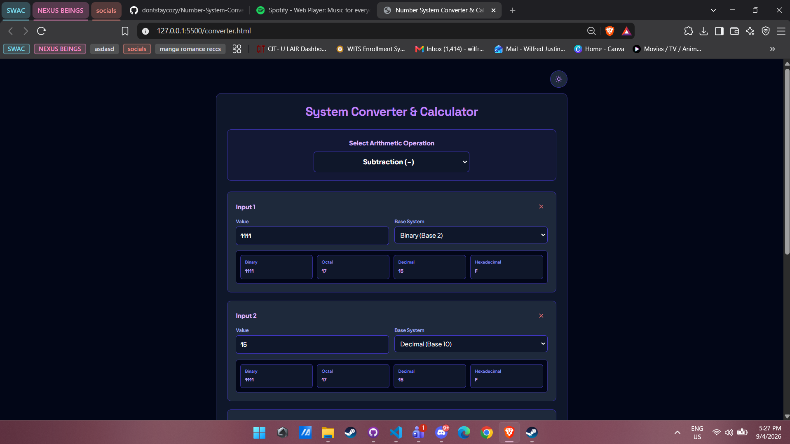
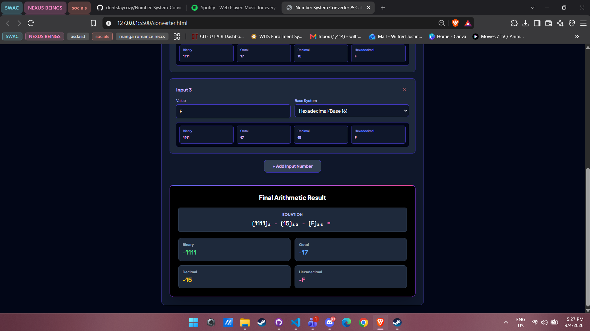
1. Inputs: `1111` (Base 2), `15` (Base 10), `F` (Base 16)
2. Global Operation: Subtraction (-)
3. Expected Output: Equation correctly identifies `(1111)₂ - (15)₁₀ - (F)₁₆`. 
4. Final arithmetic Result: Binary: `-1111`, Octal: `-17`, Decimal: `-15`, Hexadecimal: `-F`.

**Test Case 7: Octal + Decimal + Hexadecimal (Multiplication)**
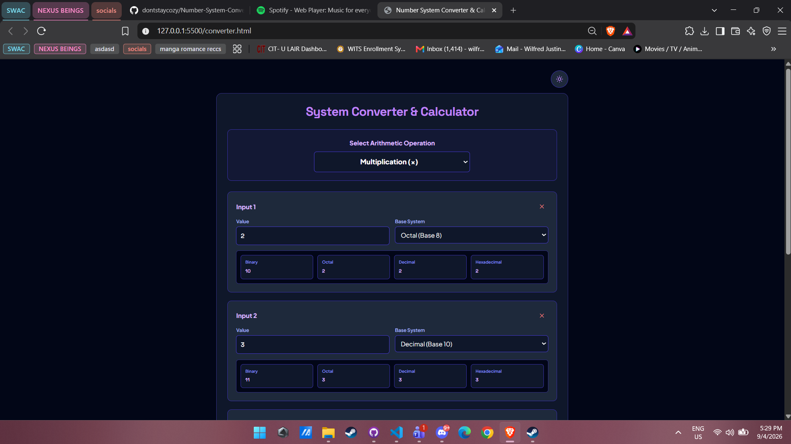
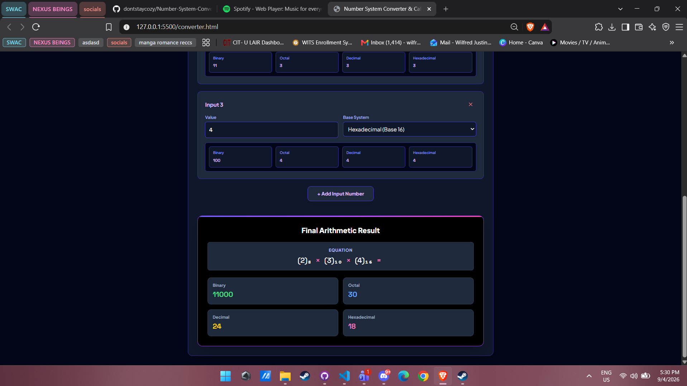
1. Inputs: `2` (Base 8), `3` (Base 10), `4` (Base 16)
2. Global Operation: Multiplication (×)
3. Expected Output: Equation correctly identifies `(2)₈ × (3)₁₀ × (4)₁₆`. 
4. Final arithmetic Result: Binary: `11000`, Octal: `30`, Decimal: `24`, Hexadecimal: `18`.

**Test Case 8: Binary + Octal + Hexadecimal (Division)**
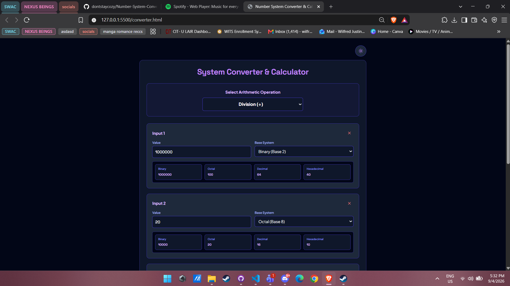

1. Inputs: `1000000` (Base 2), `20` (Base 8), `2` (Base 16)
2. Global Operation: Division (÷)
3. Expected Output: Equation correctly identifies `(1000000)₂ ÷ (20)₈ ÷ (2)₁₆`. 
4. Final arithmetic Result: Binary: `10`, Octal: `2`, Decimal: `2`, Hexadecimal: `2`.
