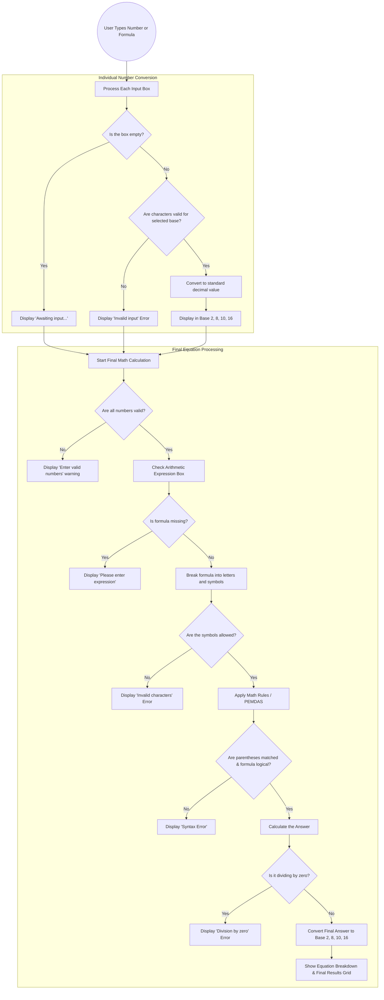

# Activity No. 1: Number System Converter and Arithmetic Calculator
**Name:** Wilfred Justin D. Peteros  
**Course & Section:** CPE463-H2  
**Instructor:** Engr. Johnalyn L. Figueras

### System Requirements
1. Hardware: A computer or laptop.
2. Software: A modern web browser like Google Chrome or Microsoft Edge.
3. Network: An active internet connection to load the Tailwind CSS framework via CDN and Google Fonts.
4. Tools: A basic text editor such as Notepad for code modification.

### Algorithm
1. Start the program.
2. Initialize the user interface with three default input cases and a custom arithmetic expression field.
3. Dynamically assign a sequential alphabetical variable (A, B, C...) to each input case.
4. Prompt the user to enter a number and select its corresponding base (Binary, Octal, Decimal, Hexadecimal) for each active input.
5. Validate each input string against the allowed characters for its selected base, including support for fractional floating-point values.
6. Display individual conversion results (Binary, Octal, Decimal, Hexadecimal) for each valid input block.
7. Convert all valid input strings into standard decimal floating-point numbers using a custom fractional parser and map them to their assigned alphabetical variables.
8. Read the custom arithmetic expression input by the user (e.g., `A + B * C`).
9. Parse the expression using the Shunting-yard algorithm to convert it from infix to postfix notation, enforcing strict operator precedence and parenthetical grouping logic.
10. Evaluate the postfix array using a stack and the mapped numeric decimal variables.
11. Display the formatted equation breakdown and the final computed arithmetic result in Binary, Octal, Decimal, and Hexadecimal formats.
12. Automatically recalculate and reassign variables (preventing alphabetical gaps) if the user dynamically adds or removes input cases.
13. Handle and display explicit errors for invalid inputs, syntax errors, mismatched parentheses, unassigned variables, or mathematical impossibilities (division by zero).
14. End the program.

### Pseudocode
```text
START PROGRAM
  SET caseCounter = 0
  CALL addCase() THREE TIMES to render initial interface

  FUNCTION reindexLabels()
    FOR EACH active case container:
      ASSIGN sequential letter (A, B, C...) based on index
    END FOR
  END FUNCTION

  FUNCTION calculateTotal()
    READ exprString FROM math-expression input
    SET variables = EMPTY MAP
    
    FOR EACH active case container:
      READ rawValue AND inBase
      IF rawValue IS INVALID THEN ABORT AND DISPLAY ERROR
      
      SET decValue = CUSTOM PARSE rawValue TO Decimal FLOAT INCLUDING FRACTIONS
      STORE decValue IN variables[assignedLetter]
    END FOR
    
    IF variables IS EMPTY OR exprString IS EMPTY THEN RETURN

    TRY
      SET tokens = EXTRACT variables, numbers, operators, parentheses FROM exprString
      SET postfix = []
      SET opStack = []
      
      // Shunting-yard Algorithm
      FOR EACH token IN tokens:
        IF token IS variable OR number:
          PUSH token TO postfix
        ELSE IF token IS operator (+, -, *, /):
          WHILE top of opStack has higher or equal precedence:
            PUSH popped opStack TO postfix
          PUSH token TO opStack
        ELSE IF token IS '(':
          PUSH token TO opStack
        ELSE IF token IS ')':
          WHILE top of opStack IS NOT '(':
            PUSH popped opStack TO postfix
          POP '(' FROM opStack
      END FOR
      
      WHILE opStack IS NOT EMPTY:
        PUSH popped opStack TO postfix

      SET finalResult = evaluatePostfix(postfix, variables)
      DISPLAY formatted equation breakdown
      DISPLAY CONVERT finalResult TO Base 2, 8, 10, 16 IN Final Output Grid
    CATCH ERROR
      DISPLAY explicit error message
    END TRY
  END FUNCTION
END PROGRAM
```

### Flowchart


### Program Implementation
```html
<!DOCTYPE html>
<html lang="en" class="dark">
<head>
  <meta charset="UTF-8">
  <meta name="viewport" content="width=device-width, initial-scale=1.0">
  <title>Number System Converter & Calculator</title>
  
  <link rel="preconnect" href="[https://fonts.googleapis.com](https://fonts.googleapis.com)">
  <link rel="preconnect" href="[https://fonts.gstatic.com](https://fonts.gstatic.com)" crossorigin>
  <link href="[https://fonts.googleapis.com/css2?family=Plus+Jakarta+Sans:wght@400;600;800&family=Space+Grotesk:wght@500;700&display=swap](https://fonts.googleapis.com/css2?family=Plus+Jakarta+Sans:wght@400;600;800&family=Space+Grotesk:wght@500;700&display=swap)" rel="stylesheet">
  
  <script src="[https://cdn.tailwindcss.com](https://cdn.tailwindcss.com)"></script>
  <script>
    tailwind.config = {
      darkMode: 'class',
      theme: {
        extend: {
          fontFamily: {
            sans: ['"Plus Jakarta Sans"', 'sans-serif'],
            mono: ['"Space Grotesk"', 'monospace'],
          }
        }
      }
    }
  </script>
</head>
<body class="bg-slate-50 dark:bg-slate-950 min-h-screen p-4 md:p-8 font-sans text-slate-800 dark:text-indigo-100 transition-colors duration-300">

  <div class="max-w-5xl mx-auto">
    <div class="flex justify-end mb-4">
      <button onclick="toggleTheme()" class="p-3 rounded-full shadow-lg bg-indigo-100 dark:bg-slate-800 text-indigo-700 dark:text-purple-400 hover:bg-indigo-200 dark:hover:bg-slate-700 border border-indigo-200 dark:border-indigo-800 transition-colors focus:outline-none focus:ring-2 focus:ring-indigo-500" title="Toggle Light/Dark Mode">
        <svg class="w-6 h-6 hidden dark:block" fill="none" stroke="currentColor" viewBox="0 0 24 24" xmlns="[http://www.w3.org/2000/svg](http://www.w3.org/2000/svg)">
          <path stroke-linecap="round" stroke-linejoin="round" stroke-width="2" d="M12 3v1m0 16v1m9-9h-1M4 12H3m15.364 6.364l-.707-.707M6.343 6.343l-.707-.707m12.728 0l-.707.707M6.343 17.657l-.707.707M16 12a4 4 0 11-8 0 4 4 0 018 0z"></path>
        </svg>
        <svg class="w-6 h-6 block dark:hidden" fill="none" stroke="currentColor" viewBox="0 0 24 24" xmlns="[http://www.w3.org/2000/svg](http://www.w3.org/2000/svg)">
          <path stroke-linecap="round" stroke-linejoin="round" stroke-width="2" d="M20.354 15.354A9 9 0 018.646 3.646 9.003 9.003 0 0012 21a9.003 9.003 0 008.354-5.646z"></path>
        </svg>
      </button>
    </div>

    <div class="bg-white dark:bg-slate-900 p-6 md:p-8 rounded-2xl shadow-xl border border-slate-200 dark:border-indigo-900 transition-colors duration-300">
      <h1 class="text-3xl md:text-4xl font-extrabold mb-8 text-center text-indigo-700 dark:text-purple-400 font-mono tracking-tight">System Converter & Calculator</h1>
      
      <div class="mb-8 p-6 bg-indigo-50 dark:bg-indigo-950/30 border border-indigo-200 dark:border-indigo-800 rounded-xl">
        <label class="block text-lg font-bold text-indigo-800 dark:text-purple-300 mb-3 text-center">Arithmetic Expression</label>
        <p class="text-sm text-center text-indigo-600 dark:text-indigo-400 mb-4">Use variables (A, B, C...) and operators (+, -, *, /, parentheses). Example: <strong>(A + B - C) * D</strong></p>
        <input type="text" id="math-expression" class="w-full md:w-3/4 mx-auto block bg-white dark:bg-slate-900 border border-indigo-300 dark:border-indigo-700 p-4 rounded-lg text-2xl text-slate-900 dark:text-white font-bold text-center focus:outline-none focus:ring-4 focus:ring-indigo-500 dark:focus:ring-purple-500 transition-colors shadow-sm uppercase tracking-widest" placeholder="A + B + C" value="A + B + C" oninput="calculateTotal()">
      </div>

      <div id="cases-container" class="grid grid-cols-1 gap-6">
        <!-- Dynamic cases injected here -->
      </div>

      <div class="mt-6 text-center">
        <button onclick="addCase()" class="bg-indigo-600 hover:bg-indigo-700 dark:bg-slate-800 dark:hover:bg-slate-700 border border-transparent dark:border-indigo-700 text-white dark:text-purple-300 font-bold py-3 px-8 rounded-xl transition-colors shadow-lg focus:outline-none focus:ring-2 focus:ring-indigo-500">
          + Add Input Number
        </button>
      </div>

      <div class="mt-12 p-8 bg-slate-900 dark:bg-black border-2 border-indigo-500 dark:border-purple-600 rounded-2xl shadow-2xl relative overflow-hidden">
        <div class="absolute top-0 left-0 w-full h-1 bg-gradient-to-r from-indigo-500 via-purple-500 to-pink-500"></div>
        <h2 class="text-2xl font-bold text-white mb-6 text-center">Final Arithmetic Result</h2>
        <div id="final-total-container" class="text-center">
          <p class="text-slate-400 text-lg">Enter valid numbers and a proper expression above to compute the result.</p>
        </div>
      </div>

    </div>
  </div>

  <script>
    let caseCounter = 0;

    function toggleTheme() {
      document.documentElement.classList.toggle('dark');
    }

    // Advanced Parser for Fractional Numbers across Base Systems
    function parseToDecimal(str, base) {
      const isNegative = str.startsWith('-');
      const cleanStr = str.replace('-', '');
      const parts = cleanStr.split('.');

      let intPart = parseInt(parts[0] || '0', base);
      let fracPart = 0;

      if (parts.length > 1) {
        let fracStr = parts[1];
        let divisor = base;
        for (let i = 0; i < fracStr.length; i++) {
          fracPart += parseInt(fracStr[i], base) / divisor;
          divisor *= base;
        }
      }

      let total = intPart + fracPart;
      return isNegative ? -total : total;
    }

    // Formatter to standardize output format
    function formatBase(num, base) {
      if (isNaN(num)) return "NaN";
      const isNeg = num < 0;
      const absVal = Math.abs(num);
      let str = absVal.toString(base).toUpperCase();
      return (isNeg ? '-' : '') + str;
    }

    function createCaseHTML(id) {
      return `
        <div id="case-${id}" data-var="" class="p-6 border border-slate-200 dark:border-indigo-800 rounded-xl bg-slate-50 dark:bg-slate-800 relative shadow-sm dark:shadow-inner transition-colors duration-300">
          <div class="flex justify-between items-center mb-4">
            <label class="case-label font-bold text-xl text-indigo-800 dark:text-purple-300 bg-indigo-100 dark:bg-indigo-900/50 px-4 py-1 rounded-full border border-indigo-200 dark:border-indigo-700">Input</label>
            <button onclick="removeCase(${id})" class="remove-btn p-2 text-red-500 dark:text-red-400 hover:text-red-700 dark:hover:text-red-300 hover:bg-red-100 dark:hover:bg-red-900/30 rounded-lg hidden transition-colors focus:outline-none" title="Remove Input">
              <svg class="w-5 h-5" fill="none" stroke="currentColor" viewBox="0 0 24 24" xmlns="[http://www.w3.org/2000/svg](http://www.w3.org/2000/svg)">
                <path stroke-linecap="round" stroke-linejoin="round" stroke-width="2" d="M6 18L18 6M6 6l12 12"></path>
              </svg>
            </button>
          </div>
          
          <div class="grid grid-cols-1 md:grid-cols-2 gap-4 mb-4">
            <div>
              <label class="block text-sm font-semibold text-slate-600 dark:text-indigo-300 mb-1">Value</label>
              <input type="text" id="val-${id}" class="w-full bg-white dark:bg-slate-900 border border-slate-300 dark:border-indigo-700 p-3 rounded-lg text-lg font-mono text-slate-900 dark:text-white focus:outline-none focus:ring-2 focus:ring-indigo-500 dark:focus:ring-purple-500 placeholder-slate-400 dark:placeholder-slate-500 transition-colors" placeholder="0" oninput="handleInput(${id})">
            </div>
            <div>
              <label class="block text-sm font-semibold text-slate-600 dark:text-indigo-300 mb-1">Base System</label>
              <select id="inBase-${id}" class="w-full bg-white dark:bg-slate-900 border border-slate-300 dark:border-indigo-700 p-3 rounded-lg text-lg text-slate-900 dark:text-white focus:outline-none focus:ring-2 focus:ring-indigo-500 dark:focus:ring-purple-500 transition-colors" onchange="handleInput(${id})">
                <option value="2">Binary (Base 2)</option>
                <option value="8">Octal (Base 8)</option>
                <option value="10" selected>Decimal (Base 10)</option>
                <option value="16">Hexadecimal (Base 16)</option>
              </select>
            </div>
          </div>

          <div id="out-${id}" class="mt-4 p-4 bg-white dark:bg-slate-950 border border-slate-200 dark:border-indigo-900 rounded-lg min-h-[80px] flex items-center justify-center text-slate-500 dark:text-indigo-400 transition-colors duration-300">
            Awaiting input...
          </div>
        </div>
      `;
    }

    function reindexLabels() {
      const cases = document.querySelectorAll('[id^="case-"]');
      cases.forEach((caseEl, index) => {
        const varLetter = String.fromCharCode(65 + index); // 0 = A, 1 = B, etc.
        caseEl.setAttribute('data-var', varLetter);
        const labelEl = caseEl.querySelector('.case-label');
        if (labelEl) {
          labelEl.textContent = `Input ${varLetter}`;
        }
      });
    }

    function addCase() {
      caseCounter++;
      const container = document.getElementById('cases-container');
      container.insertAdjacentHTML('beforeend', createCaseHTML(caseCounter));
      reindexLabels();
      updateRemoveButtons();
      calculateTotal();
    }

    function removeCase(id) {
      const caseEl = document.getElementById(`case-${id}`);
      if (caseEl && document.querySelectorAll('[id^="case-"]').length > 2) {
        caseEl.remove();
        reindexLabels();
        updateRemoveButtons();
        calculateTotal();
      }
    }

    function updateRemoveButtons() {
      const buttons = document.querySelectorAll('.remove-btn');
      if (buttons.length <= 2) {
        buttons.forEach(btn => btn.classList.add('hidden'));
      } else {
        buttons.forEach(btn => btn.classList.remove('hidden'));
      }
    }

    function handleInput(id) {
      convertIndividualNumber(id);
      calculateTotal();
    }

    function convertIndividualNumber(id) {
      const rawValue = document.getElementById(`val-${id}`).value.trim();
      const inBase = parseInt(document.getElementById(`inBase-${id}`).value);
      const outputDiv = document.getElementById(`out-${id}`);

      if (rawValue === "") {
        outputDiv.innerHTML = "Awaiting input...";
        outputDiv.className = "mt-4 p-4 bg-white dark:bg-slate-950 border border-slate-200 dark:border-indigo-900 rounded-lg min-h-[80px] flex items-center justify-center text-slate-500 dark:text-indigo-400 text-lg transition-colors";
        return;
      }

      // Regex updated to support optional fractional parts (decimals)
      let isValid = false;
      if (inBase === 2) isValid = /^-?[01]+(\.[01]+)?$/.test(rawValue);
      if (inBase === 8) isValid = /^-?[0-7]+(\.[0-7]+)?$/.test(rawValue);
      if (inBase === 10) isValid = /^-?[0-9]+(\.[0-9]+)?$/.test(rawValue);
      if (inBase === 16) isValid = /^-?[0-9a-fA-F]+(\.[0-9a-fA-F]+)?$/.test(rawValue);

      if (!isValid) {
        outputDiv.innerHTML = "<span class='text-red-600 dark:text-red-400 font-bold'>Invalid input for selected base.</span>";
        outputDiv.className = "mt-4 p-4 bg-white dark:bg-slate-950 border border-slate-200 dark:border-indigo-900 rounded-lg min-h-[80px] flex items-center justify-center transition-colors";
        return;
      }

      let decValue = parseToDecimal(rawValue, inBase);

      const binStr = formatBase(decValue, 2);
      const octStr = formatBase(decValue, 8);
      const decStr = formatBase(decValue, 10);
      const hexStr = formatBase(decValue, 16);

      outputDiv.innerHTML = `
        <div class="grid grid-cols-2 lg:grid-cols-4 gap-3 w-full">
          <div class="bg-slate-50 dark:bg-slate-900 p-3 rounded-lg border border-slate-200 dark:border-indigo-800 min-w-0 flex flex-col">
            <span class="text-xs font-semibold text-slate-500 dark:text-indigo-400 mb-1">Binary</span>
            <div class="overflow-x-auto"><span class="text-sm font-mono font-bold text-indigo-700 dark:text-purple-300 break-all">${binStr}</span></div>
          </div>
          <div class="bg-slate-50 dark:bg-slate-900 p-3 rounded-lg border border-slate-200 dark:border-indigo-800 min-w-0 flex flex-col">
            <span class="text-xs font-semibold text-slate-500 dark:text-indigo-400 mb-1">Octal</span>
            <div class="overflow-x-auto"><span class="text-sm font-mono font-bold text-indigo-700 dark:text-purple-300 break-all">${octStr}</span></div>
          </div>
          <div class="bg-slate-50 dark:bg-slate-900 p-3 rounded-lg border border-slate-200 dark:border-indigo-800 min-w-0 flex flex-col">
            <span class="text-xs font-semibold text-slate-500 dark:text-indigo-400 mb-1">Decimal</span>
            <div class="overflow-x-auto"><span class="text-sm font-mono font-bold text-indigo-700 dark:text-purple-300 break-all">${decStr}</span></div>
          </div>
          <div class="bg-slate-50 dark:bg-slate-900 p-3 rounded-lg border border-slate-200 dark:border-indigo-800 min-w-0 flex flex-col">
            <span class="text-xs font-semibold text-slate-500 dark:text-indigo-400 mb-1">Hexadecimal</span>
            <div class="overflow-x-auto"><span class="text-sm font-mono font-bold text-indigo-700 dark:text-purple-300 break-all">${hexStr}</span></div>
          </div>
        </div>
      `;
      outputDiv.className = "mt-4 p-3 bg-white dark:bg-slate-950 border border-slate-200 dark:border-indigo-900 rounded-lg min-h-[80px] transition-colors";
    }

    function evaluatePostfix(postfix, variables) {
      const valStack = [];
      for (let token of postfix) {
        if (typeof token === 'number') {
          valStack.push(token);
        } else if (variables.hasOwnProperty(token)) {
          valStack.push(variables[token]);
        } else {
          if (valStack.length < 2) throw new Error("Invalid expression syntax.");
          const b = valStack.pop();
          const a = valStack.pop();
          if (token === '+') valStack.push(a + b);
          else if (token === '-') valStack.push(a - b);
          else if (token === '*') valStack.push(a * b);
          else if (token === '/') {
            if (b === 0) throw new Error("Division by zero error.");
            valStack.push(a / b);
          }
        }
      }
      if (valStack.length !== 1) throw new Error("Invalid expression syntax.");
      return valStack[0];
    }

    function calculateTotal() {
      const cases = document.querySelectorAll('[id^="case-"]');
      const totalDiv = document.getElementById('final-total-container');
      const exprString = document.getElementById('math-expression').value.trim().toUpperCase();
      
      let variables = {};
      let displayStrs = {};
      let allValid = true;

      cases.forEach(caseEl => {
        const id = caseEl.id.split('-')[1];
        const varName = caseEl.getAttribute('data-var');
        const rawValue = document.getElementById(`val-${id}`).value.trim();
        const inBase = parseInt(document.getElementById(`inBase-${id}`).value);

        if (!rawValue) {
          allValid = false;
          return;
        }

        let isValid = false;
        if (inBase === 2) isValid = /^-?[01]+(\.[01]+)?$/.test(rawValue);
        if (inBase === 8) isValid = /^-?[0-7]+(\.[0-7]+)?$/.test(rawValue);
        if (inBase === 10) isValid = /^-?[0-9]+(\.[0-9]+)?$/.test(rawValue);
        if (inBase === 16) isValid = /^-?[0-9a-fA-F]+(\.[0-9a-fA-F]+)?$/.test(rawValue);

        if (!isValid) {
          allValid = false;
          return;
        }

        let decValue = parseToDecimal(rawValue, inBase);
        variables[varName] = decValue;

        const sub = inBase === 2 ? '₂' : inBase === 8 ? '₈' : inBase === 10 ? '₁₀' : '₁₆';
        displayStrs[varName] = `(${rawValue})${sub}`;
      });

      if (!allValid || Object.keys(variables).length === 0) {
        totalDiv.innerHTML = "<p class='text-slate-400 text-lg'>Enter valid numbers in all active fields to compute.</p>";
        return;
      }
      
      if (!exprString) {
        totalDiv.innerHTML = "<p class='text-slate-400 text-lg'>Please enter a mathematical expression.</p>";
        return;
      }

      // Regex updated to parse direct decimal numbers typed in the expression field
      const tokens = exprString.match(/[A-Z]+|[0-9]*\.?[0-9]+|[+\-*/()]/g);
      if (!tokens) {
        totalDiv.innerHTML = "<p class='text-red-400 text-xl font-bold'>Error: Invalid characters in expression.</p>";
        return;
      }

      const precedence = { '+': 1, '-': 1, '*': 2, '/': 2 };
      const postfix = [];
      const opStack = [];
      let formattedEqTokens = [];

      try {
        for (let token of tokens) {
          if (variables.hasOwnProperty(token)) {
            postfix.push(token);
            formattedEqTokens.push(`<span class="text-white">${displayStrs[token]}</span>`);
          } else if (/^[0-9]*\.?[0-9]+$/.test(token)) {
            postfix.push(Number(token));
            formattedEqTokens.push(`<span class="text-white">${token}</span>`);
          } else if (['+', '-', '*', '/'].includes(token)) {
            let symbol = token === '*' ? '×' : token === '/' ? '÷' : token;
            formattedEqTokens.push(`<span class="text-pink-400 mx-1">${symbol}</span>`);
            while (opStack.length > 0 && opStack[opStack.length - 1] !== '(' &&
                   precedence[opStack[opStack.length - 1]] >= precedence[token]) {
              postfix.push(opStack.pop());
            }
            opStack.push(token);
          } else if (token === '(') {
            formattedEqTokens.push(`<span class="text-indigo-400">(</span>`);
            opStack.push(token);
          } else if (token === ')') {
            formattedEqTokens.push(`<span class="text-indigo-400">)</span>`);
            while (opStack.length > 0 && opStack[opStack.length - 1] !== '(') {
              postfix.push(opStack.pop());
            }
            if (opStack.length === 0) throw new Error("Mismatched parentheses.");
            opStack.pop(); 
          } else {
            throw new Error(`Unknown variable: ${token}`);
          }
        }
        while (opStack.length > 0) {
          const op = opStack.pop();
          if (op === '(' || op === ')') throw new Error("Mismatched parentheses.");
          postfix.push(op);
        }

        const finalResult = evaluatePostfix(postfix, variables);

        const binStr = formatBase(finalResult, 2);
        const octStr = formatBase(finalResult, 8);
        const decStr = formatBase(finalResult, 10);
        const hexStr = formatBase(finalResult, 16);

        totalDiv.innerHTML = `
          <div class="mb-6 p-4 bg-slate-800 rounded-lg border border-slate-700 shadow-inner overflow-x-auto">
            <p class="text-indigo-300 text-sm font-bold uppercase tracking-wider mb-2">Equation Breakdown</p>
            <p class="text-xl md:text-2xl font-mono whitespace-nowrap">${formattedEqTokens.join('')} <span class="text-pink-400 mx-2">=</span></p>
          </div>
          
          <div class="grid grid-cols-1 md:grid-cols-2 gap-4">
            <div class="bg-slate-800 p-4 rounded-xl border border-slate-700 text-left overflow-hidden">
              <span class="block text-sm font-bold text-slate-400 mb-1">Binary</span>
              <div class="overflow-x-auto"><span class="text-xl md:text-2xl font-mono font-bold text-green-400 break-all">${binStr}</span></div>
            </div>
            <div class="bg-slate-800 p-4 rounded-xl border border-slate-700 text-left overflow-hidden">
              <span class="block text-sm font-bold text-slate-400 mb-1">Octal</span>
              <div class="overflow-x-auto"><span class="text-xl md:text-2xl font-mono font-bold text-blue-400 break-all">${octStr}</span></div>
            </div>
            <div class="bg-slate-800 p-4 rounded-xl border border-slate-700 text-left overflow-hidden">
              <span class="block text-sm font-bold text-slate-400 mb-1">Decimal</span>
              <div class="overflow-x-auto"><span class="text-xl md:text-2xl font-mono font-bold text-yellow-400 break-all">${decStr}</span></div>
            </div>
            <div class="bg-slate-800 p-4 rounded-xl border border-slate-700 text-left overflow-hidden">
              <span class="block text-sm font-bold text-slate-400 mb-1">Hexadecimal</span>
              <div class="overflow-x-auto"><span class="text-xl md:text-2xl font-mono font-bold text-pink-400 break-all">${hexStr}</span></div>
            </div>
          </div>
        `;
      } catch (err) {
        totalDiv.innerHTML = `<p class='text-red-400 text-xl font-bold'>Error: ${err.message}</p>`;
      }
    }

    addCase();
    addCase();
    addCase();
  </script>

</body>
</html>
```

### Test Cases

**Test Case 1: Binary Conversion**

1. Input Value: 1010
2. Selected Base: Binary (Base 2)
3. Expected Output: Binary: 1010, Octal: 12, Decimal: 10, Hexadecimal: A

**Test Case 2: Hexadecimal Conversion**

1. Input Value: 1F
2. Selected Base: Hexadecimal (Base 16)
3. Expected Output: Binary: 11111, Octal: 37, Decimal: 31, Hexadecimal: 1F

**Test Case 3: Invalid Input Handling**

1. Input Value: 9
2. Selected Base: Octal (Base 8)
3. Expected Output: "Invalid input for selected base." text appears in red.

**Test Case 4: Mathematical Bounds Limits**

1. Input Value: 99999999999999999999
2. Selected Base: Decimal (Base 10)
3. Expected Output: Hexadecimal correctly outputs 56BC75E2D63100000 instead of converting the string into scientific notation.

**Test Case 5: Operator Precedence (Binary + Octal + Decimal)**


1. Inputs: `Input A = 1010` (Base 2), `Input B = 20` (Base 8), `Input C = 2` (Base 10)
2. Arithmetic Expression: `A + B * C`
3. Expected Equation Breakdown: `(1010)₂ + (20)₈ × (2)₁₀` 
4. Expected Logic: Multiplication executes before addition. `10 + (16 × 2) = 42`.
5. Final Arithmetic Result: Binary: `101010`, Octal: `52`, Decimal: `42`, Hexadecimal: `2A`.

**Test Case 6: Parenthetical Grouping (Binary + Decimal + Hexadecimal)**


1. Inputs: `Input A = 10000` (Base 2), `Input B = 4` (Base 10), `Input C = 2` (Base 16)
2. Arithmetic Expression: `(A - B) / C`
3. Expected Equation Breakdown: `( (10000)₂ - (4)₁₀ ) ÷ (2)₁₆` 
4. Expected Logic: Parentheses force subtraction before division. `(16 - 4) ÷ 2 = 6`.
5. Final Arithmetic Result: Binary: `110`, Octal: `6`, Decimal: `6`, Hexadecimal: `6`.

**Test Case 7: Mixed Operators (Octal + Decimal + Hexadecimal)**


1. Inputs: `Input A = 12` (Base 8), `Input B = 5` (Base 10), `Input C = F` (Base 16)
2. Arithmetic Expression: `A * B - C`
3. Expected Equation Breakdown: `(12)₈ × (5)₁₀ - (F)₁₆` 
4. Expected Logic: Multiplication executes before subtraction. `(10 × 5) - 15 = 35`.
5. Final Arithmetic Result: Binary: `100011`, Octal: `43`, Decimal: `35`, Hexadecimal: `23`.

**Test Case 8: Complex Multi-Variable Expression (Binary + Octal + Hexadecimal + Binary)**


1. Inputs: `Input A = 1100` (Base 2), `Input B = 10` (Base 8), `Input C = A` (Base 16), `Input D = 11` (Base 2)
2. Arithmetic Expression: `(A + B - C) * D`
3. Expected Equation Breakdown: `( (1100)₂ + (10)₈ - (A)₁₆ ) × (11)₂` 
4. Expected Logic: Left-to-right inside parentheses, followed by multiplication. `(12 + 8 - 10) × 3 = 30`.
5. Final Arithmetic Result: Binary: `11110`, Octal: `36`, Decimal: `30`, Hexadecimal: `1E`.

**Test Case 9: Arithmetic Error Handling (Division by Zero)**

1. Inputs: `Input A = 25` (Base 10), `Input B = 0` (Base 2)
2. Arithmetic Expression: `A / B`
3. Expected Equation Breakdown: None.
4. Expected Output: Red error message stating "Error: Division by zero error." prevents the calculation.

**Test Case 10: Comprehensive Order of Operations (Mixed Bases)**


1. Inputs: `Input A = 14` (Hexadecimal), `Input B = 101` (Binary), `Input C = 4` (Octal), `Input D = 8` (Hexadecimal), `Input E = 10` (Binary)
2. Arithmetic Expression: `A + B * C - D / E`
3. Expected Equation Breakdown: `(14)₁₆ + (101)₂ × (4)₈ - (8)₁₆ ÷ (10)₂`
4. Expected Logic: Base conversions equate to (20 + 5 × 4 - 8 ÷ 2). Multiplication and division execute first `(5 × 4 = 20)` and `(8 ÷ 2 = 4)`, followed by addition and subtraction `(20 + 20 - 4) = 36`.
5. Final Arithmetic Result: Binary: `100100`, Octal: `44`, Decimal: `36`, Hexadecimal: `24`.

**Test Case 11: Fractional Input Calculation**


1. Inputs: `Input A = 23.5` (Decimal), `Input B = 10` (Decimal)
2. Arithmetic Expression: `A * B`
3. Expected Equation Breakdown: `(23.5)₁₀ × (10)₁₀`
4. Expected Logic: Multiplication of a fractional decimal by a whole decimal. `23.5 × 10 = 235`.
5. Final Arithmetic Result: Binary: `11101011`, Octal: `353`, Decimal: `235`, Hexadecimal: `EB`.

**Test Case 12: Non-Decimal Fractional Input Calculation**


1. Inputs: `Input A = 101.1` (Binary), `Input B = 1A` (Hexadecimal)
2. Arithmetic Expression: `A + B`
3. Expected Equation Breakdown: `(101.1)₂ + (1A)₁₆`
4. Expected Logic: Base conversions equate to (5.5 + 26). The fractional binary successfully adds to the whole hexadecimal. `5.5 + 26 = 31.5`.
5. Final Arithmetic Result: Binary: `11111.1`, Octal: `37.4`, Decimal: `31.5`, Hexadecimal: `1F.8`.

**Code Screenshots**


